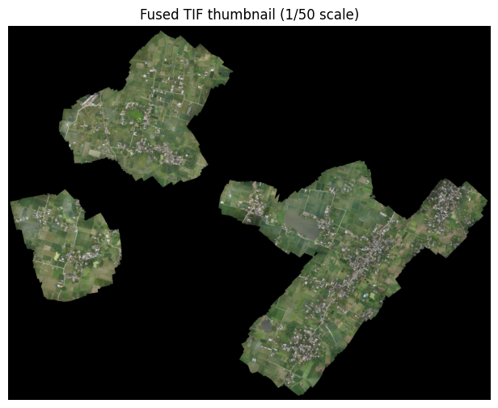
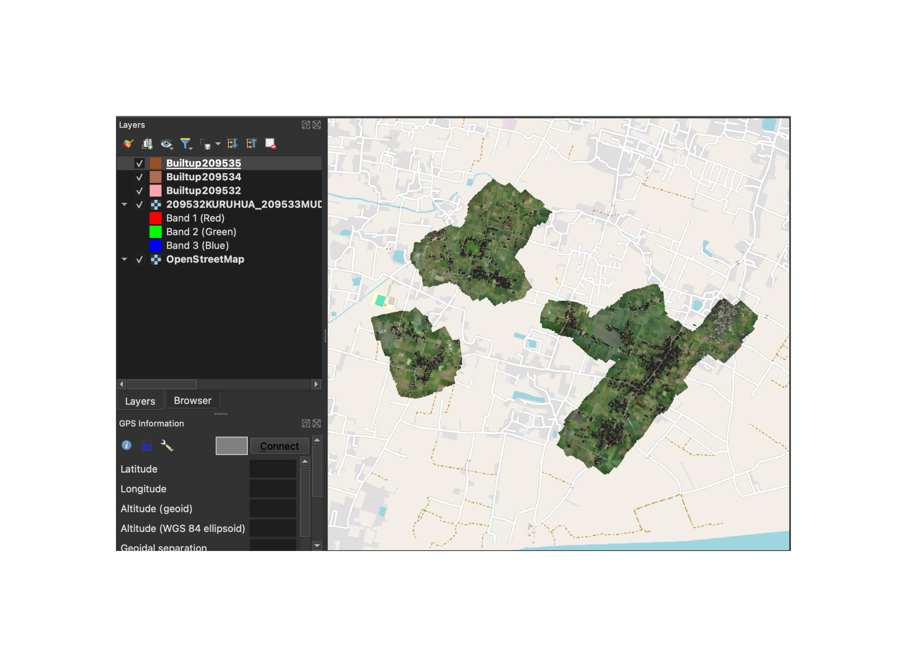
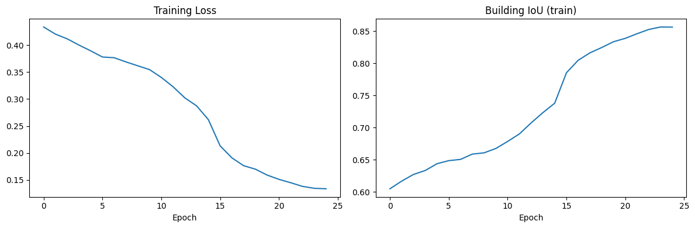
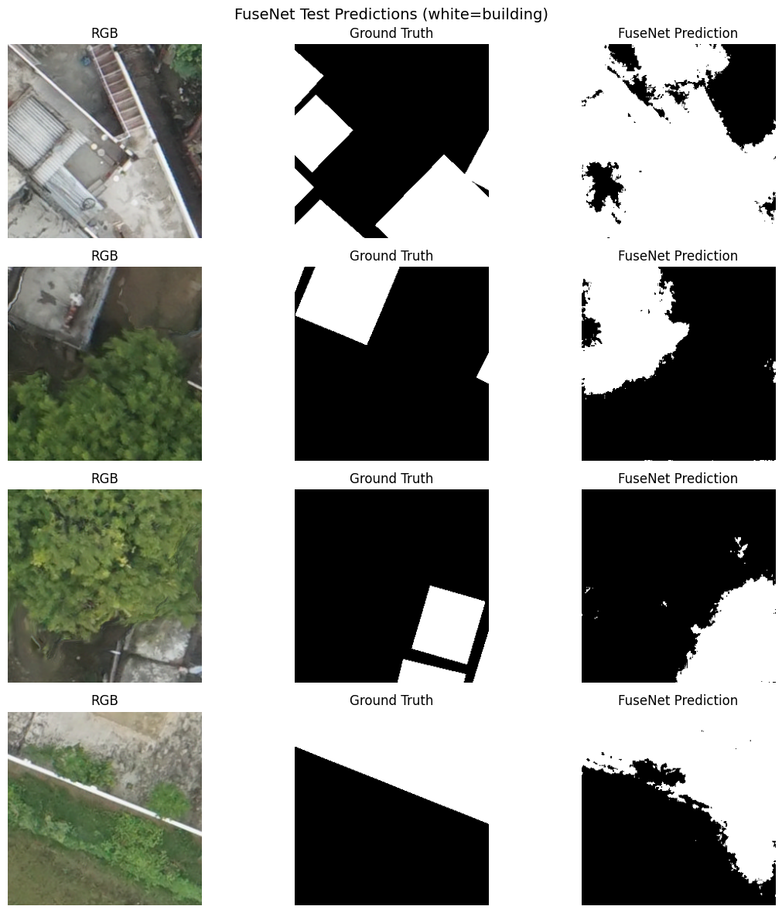

## Overview

India is mapping every rural property it has. Under the **SVAMITVA** scheme (*Survey of Villages Abadi And Mapping with Improvised Technology*), the Ministry of Panchayati Raj flies drones over village after village, producing ultra-high-resolution orthophotos and LiDAR point clouds so that, for the first time, a farmer can be handed a legal property card for the house they have always lived in. The bottleneck isn't the flying — it's turning those terabytes of imagery into *which pixels are a building and which are not*.

That's the problem this project takes on: **binary building segmentation on real SVAMITVA drone data from Uttar Pradesh**, every pixel labelled "building" or "not." The interesting twist is that the survey gives you two views of the same ground — an **RGB orthophoto** and an **elevation surface (DSM)** rasterised from a LiDAR point cloud — and the central question becomes:

> *Does knowing how **tall** something is help you decide whether it's a building, on top of knowing what **colour** it is?*

To answer it I implemented **FuseNet** (Audebert et al., 2017), an early-fusion encoder-decoder with one encoder for colour and a second, parallel encoder for height, merged by element-wise addition at every scale. The headline result is unambiguous: fusing height lifts building IoU from **0.46 to 0.63**. But the more honest story — the one that took most of the time — is the unglamorous fight to get a single 6-gigapixel survey through 12 GB of Colab RAM without it ever crashing.


## The Data — and Why It's Harder Than the Benchmark

FuseNet was born on the **ISPRS Vaihingen/Potsdam** datasets: clean, expert-annotated, well-lit German cities with crisp rectangular buildings and pre-processed elevation. SVAMITVA data is the opposite in almost every dimension, and naming those differences upfront sets honest expectations:

| Aspect | ISPRS Vaihingen/Potsdam | This SVAMITVA data |
|---|---|---|
| Resolution | 5–9 cm/pixel | **~3.5 cm/pixel** |
| Image size | many scenes, 2k–6k px | **one fused TIF, 89,761 × 69,522** |
| Bands | IRRG (infrared) | plain RGB |
| Auxiliary | pre-processed nDSM + NDVI | **raw LAZ → home-made DSM** |
| Classes | 6 (building, road, car, veg…) | **2 (building / not)** |
| Labels | pixel-perfect, contest-grade | **shapefile outlines (coarse)** |
| Scene | planned European urban | irregular Indian rural |
| Volume | thousands of patches, 16–24 images | **~600 patches from one area** |

The "Case A" data is a cluster of villages — Kuruhua, Mudhadey, Saraydengrikalan, Tarapur — with three components: a fused **RGB GeoTIFF** (EPSG:32644, ~3.5 cm/px), an airborne **LAZ point cloud** of the same ground, and **building shapefiles** (originally Web Mercator) that serve as ground truth once reprojected.



I had also intended to bring in three **Chhattisgarh** TIFs to test cross-state generalisation, but they made an instructive negative result: each TIF spanned ~213,000 × 112,000 pixels yet held only 282–2,137 building polygons — between **0.03% and 0.30%** of the scene. Even 5,000 randomly sampled candidate tiles produced *zero* patches that cleared the minimum-building threshold. Not all survey data is trainable data; some regions are simply too sparsely built to mine for labels, and recognising that early saved a lot of futile compute.



## The Real Engineering: Fitting a 6-Gigapixel Survey into 12 GB

Almost every hard decision in this project was forced by one constraint: it ran on **Google Colab with ~12 GB of RAM**. The model is the easy part. The data is what fights you.

### A DSM you can actually hold in memory

Rasterising the LAZ point cloud at the native 3.5 cm grid would mean an array of 89,761 × 69,522 float32 values — about **24 GB**. That crashes the instant you allocate it. The fix is to refuse to: I build the DSM at a coarse **1-metre** resolution instead, which collapses the grid to 3,142 × 2,434 (~30 MB). Village buildings are several metres wide and 3–10 m tall, so a 1-m surface still captures every height cue that matters.

The point cloud is streamed in **500k-point chunks** with `laspy`, each chunk reprojected to EPSG:32644 with `pyproj`, and for each ground cell I keep the **maximum return height** — vectorised with `np.maximum.at()` rather than a Python loop — then fill gaps by nearest-neighbour interpolation:

```python
for chunk in stream_laz(path, points_per_chunk=500_000):
    x, y = transformer.transform(chunk.x, chunk.y)   # → EPSG:32644
    col = ((x - x0) / 1.0).astype(int)               # 1-metre grid
    row = ((y0 - y) / 1.0).astype(int)
    np.maximum.at(dsm, (row, col), chunk.z)          # highest return wins
# remaining NaNs filled via scipy distance_transform_edt
```


### Labels rasterised one tile at a time

The same memory wall blocks label generation: a full-resolution building mask is another ~6 GB array. So I never build one. Only the vector geometries (a few MB) are loaded; then **each 256×256 tile rasterises its own mini-mask on the fly** — `GeoPandas` spatial indexing (`.cx[...]`) pulls just the polygons overlapping that tile, and `rasterio.features.rasterize(out_shape=(256, 256))` allocates a mere 64 KB:

```python
gdf = gpd.read_file(shp).to_crs(tif_crs)          # geometries only, ~MB
# per tile:
local = gdf.cx[xmin:xmax, ymin:ymax]              # spatial index → just overlaps
mask  = rasterize(local.geometry, out_shape=(256, 256), transform=tile_tf)
```

This never holds more than a single 256×256 array, which is what makes the whole thing survive on Colab.

### Tiles, and a split that doesn't cheat

Tiles are 256×256 non-overlapping patches, restricted to the shapefile's bounding box and kept only if **≥3% of pixels are building** (so the model isn't drowned in empty fields). Each survives as an `.npz` of `rgb (3,256,256)`, `dsm (1,256,256)` (bilinearly upsampled from the coarse 1-m grid), and `mask (256,256)`.

The split detail matters more than it looks: tiles are sorted **north-to-south** and the southern 20% becomes the test set. A random split would leak — adjacent tiles share near-identical features through spatial autocorrelation, and you'd score yourself on data you'd effectively already seen. The spatial hold-out is the honest version.


## FuseNet — Two Encoders, One Decoder

The naive way to use two modalities is to stack RGB+DSM into a 4-channel tensor and feed it to one network. It works poorly, because colour and height have completely different statistics and a single early conv layer has to compromise between them. FuseNet's idea is cleaner: **give each modality its own encoder**, and merge them by element-wise addition after every block.

- **Main encoder (RGB):** five VGG16-BN blocks (64 → 128 → 256 → 512 → 512 channels), each ending in a max-pool that records its pooling indices.
- **Auxiliary encoder (DSM):** structurally identical, but its first conv takes **1 channel** instead of 3.
- **Fusion:** after each block, the auxiliary activations are *added* into the main branch before pooling. The auxiliary branch pools its own un-fused activations onward. Height information is therefore injected at every scale, not just at the input.
- **Decoder:** a single shared SegNet decoder that upsamples 8×8 → 256×256 using the **main encoder's pooling indices** (`MaxUnpool2d`), ending in a 1×1 conv to 2-class logits.

The fusion is the entire trick, and in code it's almost anticlimactically simple:

```python
m = block_main(rgb)          # colour features
a = block_aux(dsm)           # height features
m, idx = self.pool(m + a)    # FUSE by addition, then pool the main branch
a, _   = self.pool(a)        # auxiliary keeps its own (un-fused) stream
```

The RGB encoder is initialised from **ImageNet VGG16-BN** weights; the DSM encoder can't reuse them (wrong channel count) so it's **Kaiming**-initialised, as is the decoder. I deliberately implemented the *standard* FuseNet, not the heavier V-FuseNet variant — the paper showed it trails V-FuseNet by only ~0.3% OA, and for a proof-of-concept on limited data the simpler model is the right call.

## Training

The recipe mirrors the paper's protocol, adjusted for a smaller dataset:

- **SGD**, momentum 0.9, weight decay 5e-4
- **Differential LR** — encoders at 0.005 (half), decoder at the full 0.01, since the encoders start pretrained or analogous
- **MultiStepLR**, ×0.1 at epochs 15 and 22 (spaced wider than the paper's 5/10/15 because fewer samples need longer to converge)
- **Class-weighted CrossEntropy** (inverse frequency) so the model can't win by predicting all-background — buildings are the minority class
- 25 epochs, batch 8, 256×256 patches, flips + 90° rotations for augmentation
- **Colab T4 GPU**, not TPU — `MaxUnpool2d` isn't supported under XLA

Training was well-behaved: loss fell steadily to **0.134** and training building IoU climbed to **0.856**, with a clear inflection right at the epoch-15 LR drop.



## Results — Does Height Actually Help?

On **124 spatially held-out test tiles**, FuseNet scored **82.0% overall accuracy**, **building F1 0.769**, and **building IoU 0.624**. The gap from the 0.856 training IoU is honest overfitting — inevitable when all your tiles come from one village cluster.



The decisive experiment is the **ablation**. Because FuseNet fuses by *addition*, you can switch the height modality off at inference simply by feeding the auxiliary encoder **all zeros** — no retraining needed. That collapses FuseNet to an RGB-only SegNet and answers the central question directly:

| Model | OA | Building F1 | Building IoU |
|---|---|---|---|
| **FuseNet (RGB + DSM)** | **82.1%** | **0.776** | **0.633** |
| RGB-only (zeroed DSM) | 56.4% | 0.630 | 0.460 |
| **Gain from height** | **+25.7%** | **+0.146** | **+0.173** |

Height buys **+17 IoU points** — a far larger lift than the ~0.6% OA gain FuseNet saw on Vaihingen. The reason is intuitive: Indian rural rooftops often blend spectrally into the surrounding earth and dust, so colour alone is ambiguous in a way crisp European roofs never were. The moment you tell the network *this pixel is three metres higher than its neighbours*, the ambiguity dissolves. The deep-learning models also crush the classical baselines outright:


Set against the original paper, the absolute numbers are lower (their building F1 was 0.943) — but it isn't an apples-to-apples comparison: they had 6 classes diluting boundary error, thousands of patches across 16 images, expert pixel-perfect labels, a *normalised* DSM plus NDVI, and 3-pixel border erosion on their metrics. Given one TIF, coarse vector labels, and a blurry home-made DSM, **the qualitative finding is what transfers, and it's stronger here than in the paper: multimodal fusion with height clearly improves rural building segmentation.**

## Shipping It

The trained model and both classical baselines (HOG+SVM, GLCM+SVM) are wrapped in a **Gradio app** — deployed to Hugging Face Spaces and runnable locally — that lets you pick any test tile and watch all four models segment it side by side, with a TP/FP/FN colour overlay (green = correct building, red = false alarm, orange = missed) and live per-tile IoU/F1. It makes the abstract "FuseNet beats SegNet beats SVM" table into something you can *see* tile by tile.

## What I Learned

- **The model was never the hard part — the memory was.** Streaming the LAZ in chunks, building a 1-m DSM instead of a 24 GB native one, and rasterising labels per-tile (64 KB at a time) are what made the project *possible*. None of that shows up in the architecture diagram, and all of it was the actual work.
- **Match the data to the question, and be willing to throw data away.** The Chhattisgarh TIFs were huge and tempting, but at 0.03–0.30% building coverage they yielded zero usable tiles. Recognising that *some survey data is untrainable* is itself a result.
- **An ablation can be free.** Because FuseNet fuses by addition, zeroing the DSM at inference gives a clean RGB-vs-RGB+DSM comparison without training a second model — and it's that single experiment that turns "I built a fancy network" into "height is worth +17 IoU points."
- **Borrow the protocol, not the expectations.** Differential learning rates, class weighting, and ImageNet-initialised encoders came straight from the paper and just worked. The paper's *accuracy numbers* did not transfer — and they shouldn't have, given how different the data is. Knowing which parts of a reference to copy is the skill.
- **Spatial splits or it doesn't count.** A north-south hold-out instead of a random split is the difference between a believable IoU and a flattering lie.

## Limitations & Next Steps

- **One geographic area** means no chance to learn cross-village diversity — the overfitting gap (0.86 train vs 0.62 test IoU) is the symptom. More villages is the single biggest lever.
- **The DSM is raw, coarse, and not normalised.** A proper **nDSM** (height *above ground*, by subtracting a DTM) would isolate building height from terrain slope; a native-resolution DSM would sharpen boundaries. Both should help meaningfully.
- **Labels are vector outlines**, not pixel-perfect masks, so a chunk of the residual boundary error is the ground truth's fault, not the model's.
- **The cross-state question is still open.** Fixing Chhattisgarh tile extraction — sampling near building-polygon centroids instead of randomly — would finally make generalisation testable, and trying **V-FuseNet** or a ResNet-based fusion backbone is the natural way to push past 0.63.
