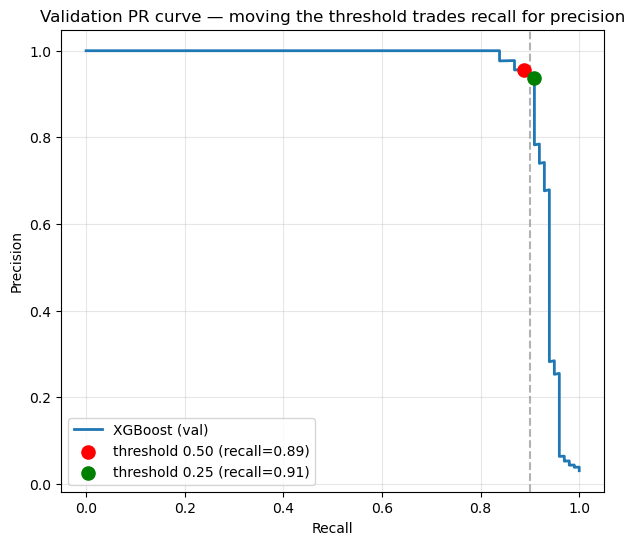
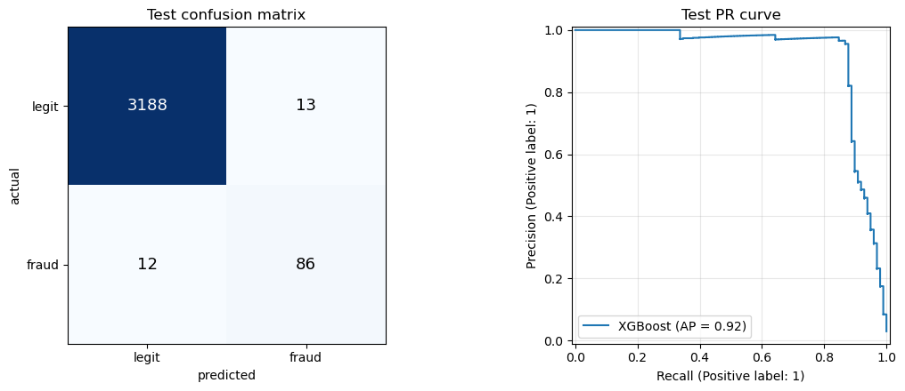
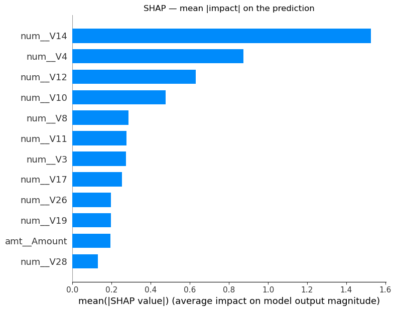
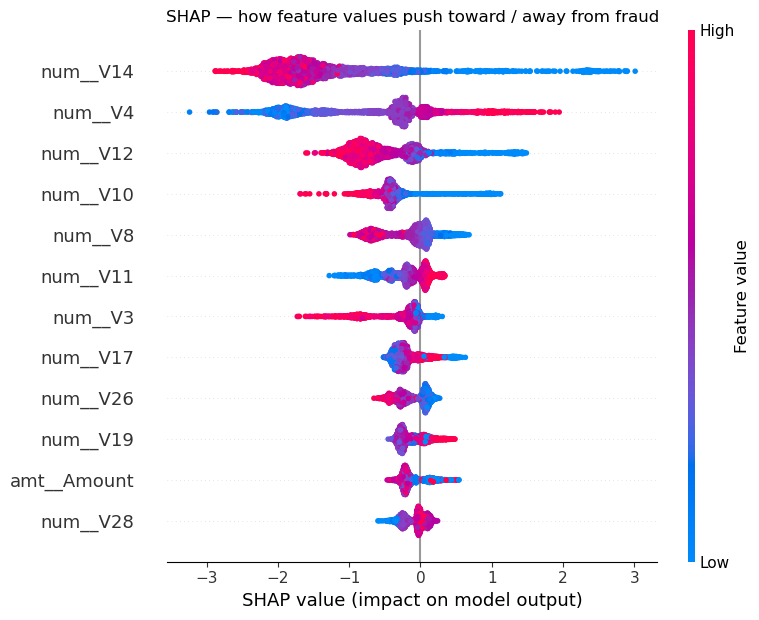
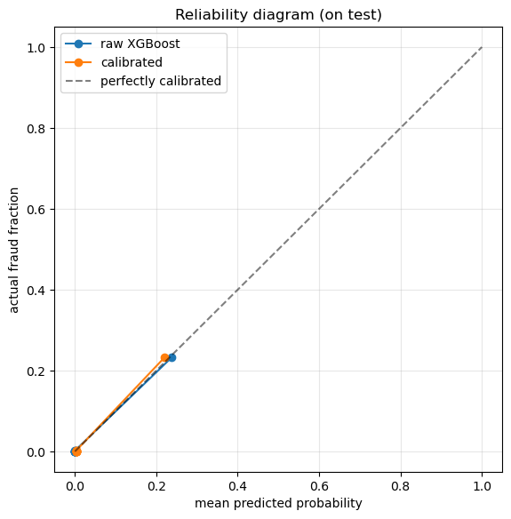

## Overview

When I started learning ML I kept asking a naive question: *is there such a thing as the best estimator, and if there is, how do you build one?* Redoing this fraud-detection exercise as a pure learning activity is where that question finally dissolved. There is no universally best model. There is only the best model **for a stated task, on a stated dataset, at a stated operating point** — and getting there is less about clever algorithms than about slowing down, using statistics to actually look at the data, writing your assumptions down, and testing each one before you act on it.

So this project is intentionally unglamorous. It is a fraud-detection dataset — 16,492 transactions, 492 of them fraudulent (a 2.98% positive rate) — and the whole point is to do the simple things *correctly*: a real EDA, imputation with assumptions stated, leakage-free evaluation, an operating point chosen for the task rather than defaulted to, and the intellectual honesty to report the experiments that **didn't** work.

One structural note about the data before anything else: the features `V1`–`V28` are **PCA components**, so they are already orthogonal, mean-centred, and anonymised. That single fact quietly changes the playbook — there's no raw feature to interpret, no obvious interaction to hand-engineer, and no collinearity to fight. It's the cleanest possible sandbox for practising discipline.

## The Task Defines Everything

Before touching a model I forced myself to answer: *what does a good answer even look like here?* Fraud detection is asymmetric. A missed fraud (false negative) is a real loss; a false alarm (false positive) is a review cost. We care more about **recall** than raw accuracy — a model that predicts "never fraud" is 97% accurate and completely useless.

That decision cascades into everything downstream:

- **Primary metric: PR-AUC** (average precision), not ROC-AUC or accuracy. At 3% positives, ROC-AUC is flattered by the huge negative class; the precision-recall curve is where the imbalance actually shows up.
- **Imbalance handled with class weights**, not resampling. For tabular data at this ratio, `class_weight='balanced'` (and XGBoost's `scale_pos_weight ≈ 32.5`) reweights the loss so each fraud counts as much as ~32 legitimate transactions. No SMOTE, no synthetic minority rows — just an honest reweighting of the objective.
- **The threshold is a separate decision from the model.** A classifier outputs a score; 0.5 is an arbitrary default. Choosing where to cut is a business call about the recall floor, made *after* training.

## EDA: Slowing Down Enough to Catch the Traps

This is where the time went, and where most of the learning lives. Three assumptions looked obviously true and only one survived contact with the data.

### Assumption 1 — "The missingness must mean something"

The dataset has missing values in tiers: `V2/V5/V13/V19` (~4% missing), `V4/V16/V21/V24` (~17%), and `V7/V27` almost entirely blank (~93%). The tempting story is that *whether* a value is missing is itself a fraud signal. So I tested it directly instead of assuming:

```
fraud rate | V7 present: 0.0295
fraud rate | V7 blank  : 0.0299
--> nearly identical => missingness carries no fraud signal (MCAR)
```

The fraud rate is essentially identical whether `V7` is present or blank. The missingness is **MCAR** (Missing Completely At Random) — it carries no information. That's what licenses plain median imputation with a clear conscience: I'm not erasing a signal, because the test says there isn't one. Assumption stated, assumption tested, assumption acted on.

### Assumption 2 — "V7 is a strong predictor" (the correlation trap)

`V7` shows a correlation of **−0.470** with the target — one of the strongest in the table. It looks like a feature you'd fight to keep. But `V7` is 93% missing, and pandas' `.corr()` silently uses **pairwise deletion**: it computes that −0.470 from only the 7% of rows where `V7` is present. Once I impute the blanks and measure the correlation on the *full* column the model will actually see:

```
V7 corr (pairwise, present rows only): -0.470  <- looks strong
V7 corr (after mean-imputing blanks) : -0.123  <- collapses
```

The "strong predictor" was a small, unrepresentative subsample talking. This is the single most valuable thing I relearned: a correlation number is only as trustworthy as the rows it was computed on, and default tooling will hide that from you.

### Assumption 3 — "The categorical columns must add signal"

The set includes three categorical columns (`V29`, `V30`, `V31`). Rather than one-hot them and hope, I checked the per-category fraud rate against the 2.98% baseline:

```
V30: a5=4.18%  ...  a2=2.22%  a9=1.95%   (baseline = 2.98%)
V31: b1=3.12%  b3=2.94%  ...  b5=2.67%
```

Every category hovers around the base rate with no meaningful separation — these are essentially noise. I kept them in the pipeline (they do no harm, and a tree can ignore them), but I went in *knowing* not to expect anything, rather than being surprised later.

## Leakage-Free Evaluation

Everything is split **before** any preprocessing is fit, and every transform (imputation, scaling, encoding) lives inside a scikit-learn `Pipeline`/`ColumnTransformer` that is fit on training data only. The split is a stratified 60/20/20:

```
train n= 9,894  frauds=295  (2.98%)
val   n= 3,299  frauds= 99  (3.00%)
test  n= 3,299  frauds= 98  (2.97%)
```

Stratification keeps the fraud rate stable across all three splits — critical when the positive class is this thin. The **test set is opened exactly once**, at the very end. Everything else — scaler choice, model choice, threshold, tuning — happens on train/val (the "dev" set).

## Does Taming the Tails Help? (Experiment A)

The PCA features are heavy-tailed (kurtosis into the hundreds). Conventional wisdom says a linear model will struggle unless you tame those tails, so I ran the actual experiment — logistic-regression validation PR-AUC under three scalers:

```
        scaler   val_PR_AUC
  RobustScaler       0.9169
StandardScaler       0.9168
    YeoJohnson       0.9071
```

`StandardScaler` and `RobustScaler` are a dead heat, and the Yeo-Johnson power transform — the one that most aggressively reshapes the tails — actually *hurts*. Because the features are already PCA components, they're well-behaved enough that fancier scaling buys nothing. So the pipeline uses plain `StandardScaler`. A negative result, but a decisive one: complexity has to earn its place.

## Three Models, One Fair Comparison

With the pipeline fixed, I trained Logistic Regression, Random Forest, and XGBoost under identical preprocessing and compared validation PR-AUC:

```
        model   val_PR_AUC   val_ROC_AUC
      XGBoost       0.9361        0.9733
 RandomForest       0.9283        0.9675
       LogReg       0.9168        0.9710
```

XGBoost wins on the metric that matters here, but notice how *close* everything is — even plain logistic regression is within striking distance. On a clean, orthogonal feature set, the gap between a linear model and a tuned gradient-boosted ensemble is small. The dataset, not the algorithm, is doing most of the work.

### What the model actually uses vs. what correlation says

I pulled permutation importances from the trained model and set them next to the raw correlation ranking. They tell noticeably different stories:

```
      corr_rank      perm_rank
#1   V14 (0.72)     V14 (0.066)
#2   V12 (0.66)     V12 (0.038)
#3   V17 (0.63)      V4 (0.023)
#4   V10 (0.59)     V20 (0.005)
#5   V16 (0.54)     V10 (0.005)
```

`V14` and `V12` top both lists, but after that they diverge: `V4` is only the 8th-strongest correlation yet the 3rd most *used* feature, while `V16`, `V3`, and `V11` rank high on correlation and drop out of what the model relies on. Correlation measures a linear, one-feature-at-a-time relationship; permutation importance measures what the model actually leans on once every feature is competing. They are not the same question.

## Choosing the Operating Point

This is the step most tutorials skip. The trained model produces a score per transaction; I then drew the full precision-recall curve on validation data and deliberately chose a cut for the **recall** we want, rather than accepting the 0.5 default.



```
default thr=0.50  -> precision=0.957, recall=0.889
chosen  thr=0.255 -> precision=0.938, recall=0.909
```

Lowering the threshold from 0.50 to 0.255 buys **2 extra points of recall** (catching more fraud) for **under 2 points of precision** — a good trade when a missed fraud costs more than a review. This is what "optimising for recall" concretely means: not a different loss function, but a deliberate move along a curve you've drawn.

## The One Honest Look at the Test Set

Only now — model fixed, threshold fixed — do I open the test set, once:



```
=== XGBoost @ threshold 0.255 ===
PR-AUC  (test): 0.9160
ROC-AUC (test): 0.9909
F2      (test): 0.8758
```

The test PR-AUC (0.916) sits right in line with the cross-validated dev estimate (XGBoost CV PR-AUC 0.914 ± 0.025), which is exactly what you want to see — no nasty gap between what the model promised and what it delivered on data it never touched.

## Explaining the Model with SHAP

A fraud model that can't explain a decision is hard to deploy. SHAP decomposes each prediction into per-feature contributions, and the global picture is consistent with everything above:





`V14`, `V12`, and `V4` dominate — the same features permutation importance flagged, now with *direction*: the beeswarm shows how high vs. low values of each feature push a transaction toward or away from fraud. Two independent methods agreeing on the same short list is a good sign the model is reading a real structure, not memorising noise.

## The Experiments That Didn't Work (and Why That's the Point)

A big part of doing this honestly is reporting the things I tried that failed. Both are exactly the moves an over-eager résumé reaches for.

**Feature engineering (interactions + squares).** I built 15 engineered features — pairwise interactions and squares of the top predictors — and measured the change in validation PR-AUC:

```
    model   base_PR_AUC   with_interactions    delta
   LogReg        0.9168              0.9118   -0.0051
  XGBoost        0.9361              0.9310   -0.0051
```

Both models got *slightly worse*. This is exactly what the PCA structure predicts: the features are already orthogonal, so hand-built interactions mostly add noise, and trees can already discover any interaction they need. Feature engineering is not free virtue — on the wrong dataset it's just variance.

**Hyperparameter tuning.** A 25-iteration randomised search found a config with a marginally better *cross-validation* score (0.9149 vs the default's dev estimate), but on the untouched test set:

```
default XGB  test PR-AUC=0.9160
tuned XGB    test PR-AUC=0.8886
```

The tuned model was *worse* on test. The CV "improvement" was small enough to be noise, and chasing it overfit the validation folds. The disciplined move is to keep the simpler default — a lesson that only shows up if you're honest about which number is allowed to make the decision.

## Probability Calibration

The final question: when the model says "0.9", is it fraud 90% of the time? For decisions driven by expected cost, the score needs to be a trustworthy probability, not just a good ranking. I fit a calibrator on held-out data and compared before/after with a reliability diagram and the Brier score:



```
Brier  raw=0.0054  calibrated=0.0051   (lower is better)
PR-AUC raw=0.9160  calibrated=0.9160   (unchanged, as expected)
mean predicted: raw=0.030  cal=0.030   |  true fraud rate=0.030
```

XGBoost is already close to calibrated here — the mean predicted probability (0.030) matches the true fraud rate (0.030) almost exactly, and calibration nudges the Brier score down without moving PR-AUC (calibration is monotonic, so it can't change the ranking). Worth knowing the tool, worth knowing when it isn't needed.

## What This Project Is Really About

The headline number is fine — PR-AUC 0.916 on a held-out test set, at a recall-oriented operating point, with an explainable model. But the number isn't the point. The point is the *process*:

- **State assumptions, then test them.** MCAR missingness, the categorical columns, the correlation trap — each was a claim I checked against the data before acting.
- **Let evidence pick complexity.** Scaling, feature engineering, and tuning were all run as real experiments, and all three said "the simpler thing is better here."
- **Separate the model from the decision.** The threshold is chosen for the task, not defaulted.
- **Report the negatives.** The failed experiments are as much a result as the successful ones.

There is no best estimator in the abstract. There is a task, a dataset, an operating point, and the discipline to connect them honestly. On a simple fraud dataset, that discipline *is* the skill.
