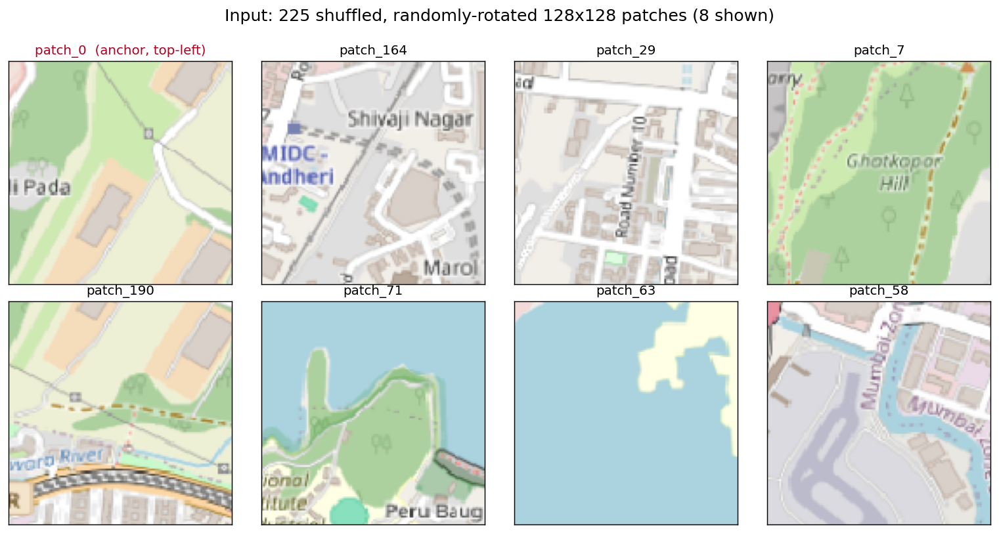
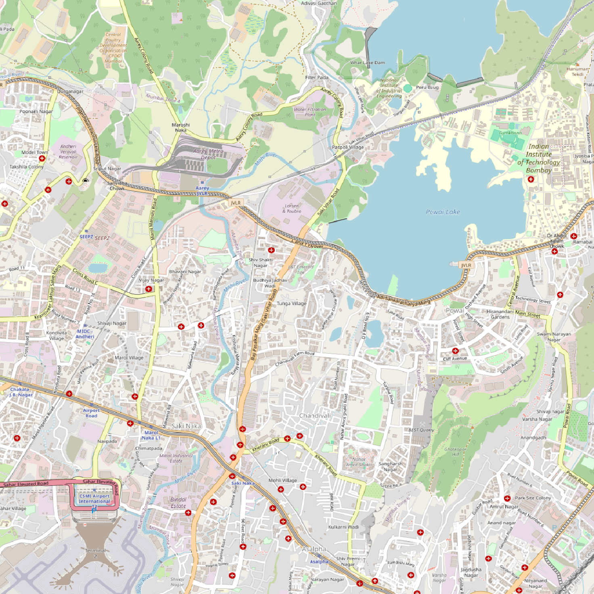
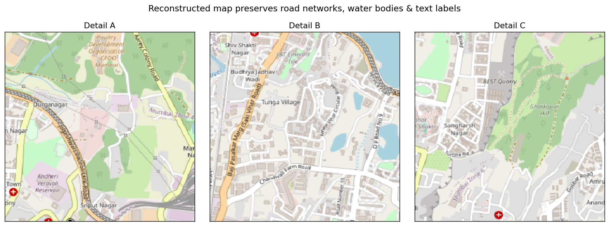
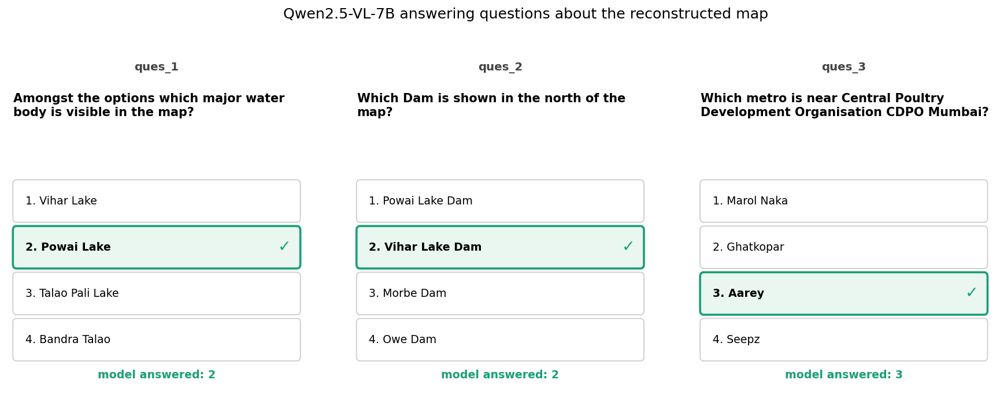

## Overview

This project tackles a two-part geospatial challenge from a course competition (GNR 638, IIT Bombay). You are handed a folder of image patches that were cut out of one large aerial/street map — but the patches are **shuffled out of order, each rotated by a random multiple of 90°, and they overlap their neighbours by an unknown number of pixels**. The only fixed point is `patch_0`, which is guaranteed to be the top-left corner.

The task has two stages:

1. **Reconstruction** — reassemble the original map from the scrambled patches.
2. **Visual Question Answering (VQA)** — feed the reconstructed map to a vision-language model and answer multiple-choice questions about it ("which water body is visible?", "which dam is to the north?").

What makes it interesting is the second-order constraint: the answers are **scored with negative marking**, so a confident wrong answer costs you, and the system has to know when to *abstain* rather than guess. The pipeline runs fully **offline at inference** on a 48 GB GPU, within a one-hour budget.

## The Problem

The sample set is **225 patches of 128×128 px**, which factor into a **15×15 grid**. The final graded set is hidden and may differ in size, so nothing can be hard-coded — the pipeline has to infer the grid, the overlap, and every rotation from the pixels alone.

The scoring rule is the part that shapes the whole design:

| Outcome | Points |
|---|---|
| Correct answer | **+1** |
| Wrong answer | **−0.25** |
| Skipped (answer = `5`) | **0** |
| Hallucinated value (anything not 1–5) | **−1** |

This turns the VQA stage from "maximise accuracy" into "maximise expected score" — and it makes *never emitting an invalid token* a hard safety requirement, not a nicety.

The single insight that the entire reconstruction leans on:

> The patches are **exact crops of one source image**. Wherever two patches overlap, those pixels are *byte-for-byte identical*. So a correct alignment doesn't just produce a *low* pixel error — it produces an error of essentially **zero**. That is what lets me replace heavyweight feature matching (SIFT/ORB, RANSAC homographies) with plain pixel MSE on the overlapping strip.



## Stage 1 — Reconstruction

### Inferring the grid and detecting the overlap

With `N` patches and no metadata, the grid is just the factor pair of `N` closest to square (225 → 15×15). The overlap width is unknown, so I **treat it as a hypothesis to test against pixels**. For each candidate overlap `O` from 8 px up to half a patch, I check whether `patch_0`'s right edge matches *some* other patch's left edge — under any of its four rotations — to near-zero MSE, and independently confirm the same on the bottom edge:

```python
def detect_overlap(imgs, patch_size):
    patch0 = imgs[0].astype(np.float32)
    candidates = list(range(8, patch_size // 2 + 1))
    for overlap in candidates:
        ref_right = patch0[:, -overlap:, :]          # patch_0's right strip
        right_ok = any(
            np.mean((ref_right - np.rot90(imgs[i], rot).astype(np.float32)[:, :overlap, :]) ** 2) < 0.01
            for i in range(1, len(imgs)) for rot in range(4)
        )
        # ...identical check on patch_0's bottom strip -> bot_ok...
        if right_ok and bot_ok:
            return overlap                            # both edges confirm -> done
```

Requiring **two independent edges** to confirm avoids a coincidental single-edge match, and the `< 0.01` threshold is essentially "pixel-identical" — only credible because the overlaps are exact crops. On the sample set this locks onto a **32 px overlap** immediately.

### Scoring a placement: per-edge MSE

When I try to drop a candidate patch into an empty grid cell, I don't score it with one averaged number. I score it against **each already-placed neighbour edge separately**, and then take the **worst** edge as its score:

```python
def compute_per_edge_mse(candidate, placed, row, col, overlap):
    edges, cand = [], candidate.astype(np.float32)
    if (left := placed.get((row, col - 1))) is not None:
        edges.append(("left",  np.mean((left[:, -overlap:, :]  - cand[:, :overlap, :])  ** 2)))
    if (top  := placed.get((row - 1, col))) is not None:
        edges.append(("top",   np.mean((top[-overlap:, :, :]   - cand[:overlap, :, :])  ** 2)))
    # ...right and bottom symmetric...
    return edges     # caller uses max(mse) as the placement score
```

Why the *max* edge and not the *mean*? Because averaging lets one perfect edge mask one terrible edge. If a patch matches its left neighbour flawlessly but clashes with the top, the mean still looks acceptable — and you've placed a wrong patch that every later placement now has to build on. Scoring by the **worst** edge enforces that *all* constraints are satisfied simultaneously.

### Confidence-first assembly

The placement itself is a greedy BFS that grows outward from the anchor, but with a deliberate ordering rule: **always fill the most-constrained cell first.** A cell hemmed in by two already-placed neighbours is far less ambiguous than one with a single neighbour, so locking those in early gives the harder, later placements more evidence to lean on. For each frontier cell, I sweep every remaining patch × 4 rotations and keep the lowest worst-edge score under a threshold:

```python
def find_best_for_slot(row, col, max_edge_threshold):
    best_max_edge, best_pid, best_rot = 1e9, -1, 0
    for pid in remaining:
        for rot in range(4):
            edges = compute_per_edge_mse(np.rot90(imgs[pid], rot), placed_arr, row, col, overlap)
            if not edges:
                continue
            max_edge = max(mse for _, mse in edges)              # worst edge
            if max_edge <= max_edge_threshold and max_edge < best_max_edge:
                best_max_edge, best_pid, best_rot = max_edge, pid, rot
    return best_pid, best_rot, best_max_edge
```

This runs in **escalating passes** so that certainty comes first and robustness comes last:

- **Strict pass** — only place where the worst edge is `< 5` MSE, prioritising cells with the most placed neighbours.
- **Relaxed pass** — loosen the threshold (50 with two-plus neighbours, 200 with one) so the seam can keep growing.
- **Forced fallback** — if a sweep stalls, drop in the single best remaining patch so the assembly can never deadlock.

The result on the sample set is a clean **1472×1472** reconstruction with all 224 non-anchor patches placed:



The reconstruction is faithful enough that fine detail survives — road networks line up across seams, and water bodies and **text labels remain legible**, which is exactly what the next stage needs:



## Stage 2 — Visual Question Answering

### Model and quantization

For the VQA stage I use **Qwen2.5-VL-7B-Instruct**, a 7-billion-parameter vision-language model, **zero-shot** — there is no training data in this competition, and a strong instruction-tuned VLM handles open-ended map questions out of the box. The whole reconstructed map is passed as a single image alongside each question.

The loader picks precision based on the GPU it finds at runtime:

- **≥ 20 GB VRAM** (the L40s grading server) → **fp16** (~17 GB).
- **smaller GPUs** → **4-bit NF4 quantization** via bitsandbytes (~6 GB), with double-quant and an fp16 compute dtype.

NF4 ("NormalFloat-4") spaces its quantization levels to match the roughly-normal distribution of neural-network weights, so the 4× memory saving costs very little accuracy; the weights are *stored* in 4 bits but de-quantized to fp16 on the fly for the actual matrix multiplies. This is a *storage* trick, which is why the quality hit is modest — and it's what let me develop the exact same pipeline on a small GPU and run it full-precision for grading.

### The prompt and the abstain hook

Every line of the prompt does a job — suppress outside knowledge, steer attention to map features, constrain the output to a single parseable token, and expose the abstain option:

```text
You are looking at a satellite/aerial map. Answer the following multiple-choice
question based ONLY on what you can see in this map.

Question: {question}
Option 1: {...}   Option 2: {...}   Option 3: {...}   Option 4: {...}

Instructions:
- Look carefully at the map for labels, roads, water bodies, landmarks, and text.
- Reply with ONLY a single digit: 1, 2, 3, or 4.
- If you truly cannot determine the answer, reply with 5.
Your answer:
```

Decoding is **greedy** (`do_sample=False`, `max_new_tokens=16`) — this is classification, so I want deterministic, reproducible, single-token answers, not prose. Parsing then defends against everything the scoring rule punishes:

```python
def parse_answer(raw_response):
    match = re.search(r"[1-5]", raw_response.strip())
    return int(match.group()) if match else 5     # unparseable -> skip, never penalised
```

Anything the model can't answer cleanly collapses to `5` (skip, zero penalty); any exception during generation also falls back to `5`; and before the file is written, every value is clipped to `1–5` and `assert`-ed. Given that a stray token costs a **full −1**, this "never crash, never emit garbage" guarantee is worth the three redundant layers.

> **A decision-theory footnote I like:** with four options and a −0.25 penalty, a *purely random* guess actually has positive expected value (`0.25·(+1) + 0.75·(−0.25) = +0.0625`). So "always abstain" is technically EV-suboptimal — the abstain is really a **risk/variance-reduction** choice that pays off when the model's wrong answers are *worse* than random (a confidently-wrong VLM often is) or when the penalty is steeper. The rigorous version would calibrate on the model's own confidence and abstain only below the break-even probability.

### Running it on Apple Silicon

The graded pipeline targets CUDA, but I wanted to verify the VQA stage on my own machine (an M1 Pro, 17 GB) for this writeup. The bitsandbytes 4-bit path is CUDA-only and fp16 won't fit in 17 GB, so I ran the **same model and the same prompt through Apple's MLX runtime** (`mlx-community/Qwen2.5-VL-7B-Instruct-4bit`), which is built for Apple Silicon and fits comfortably in unified memory. Same weights, same question, different engine.

On the three sample questions, the model **answered all three** — it didn't need the abstain — and the two answers I can verify against legible labels in the reconstruction are **correct**:



- **"Which major water body is visible?" → Powai Lake.** Correct — it's the prominent labelled lake at the centre-right of the map.
- **"Which dam is shown in the north?" → Vihar Lake Dam.** Correct — the reconstruction renders the *"Vihar Lake Dam"* label sharply at the top edge, and the model read it directly.
- **"Which metro is near CPDO Mumbai?" → Aarey.** Consistent with CPDO's location in the Aarey belt.

That second answer is the whole pipeline in one data point: the model isn't guessing from a vague prior — it's **reading text that only exists because the seam between two patches was reconstructed correctly**. A mis-stitched map would have torn that label apart and the VLM would have had nothing to read.

## What I Learned

- **Match the tool to the structure of the data.** The temptation was to reach for SIFT/RANSAC image registration. Recognising that the overlaps were *exact crops* collapsed the whole problem to near-zero-error pixel MSE — simpler, faster, and more reliable than feature matching would have been. The hardest part of a CV problem is often noticing which assumption makes it easy.
- **Greedy works if you order by confidence.** A naive greedy jigsaw cascades errors. Placing the most-constrained cells first, behind a strict threshold, and only then relaxing, kept a single bad placement from propagating — without the cost of a full global optimiser.
- **Scoring rules are part of the model.** The −0.25 / −1 penalties turned this from an accuracy problem into an expected-value problem, where knowing when *not* to answer, and never emitting an invalid token, mattered as much as raw correctness.
- **Quantization is a deployment lever, not just a memory trick.** Auto-selecting fp16 vs. 4-bit by VRAM — and falling back to MLX on Apple Silicon — is what made the same code portable across a grading server, a small dev GPU, and a laptop.
- **The gap between a notebook and a pipeline is robustness.** Offline-only loading, auto-inferred grid/overlap, defensive answer parsing, and the clip-and-assert guard are the unglamorous parts that decide whether the thing survives an unseen test set.

## Limitations & Next Steps

- The greedy assembly has **no backtracking** — a forced bad placement is permanent. A global consistency check or an MRF/constraint-satisfaction formulation with backtracking would harden it against adversarial inputs.
- The `< 0.01` MSE assumption breaks under **lossy compression or resampling**; normalized cross-correlation with a tuned threshold would generalise to non-exact overlaps.
- The whole map is sent to the VLM as one image, so on a very large map fine detail gets downsampled away — **tiling and routing** each question to the relevant region would scale better.
- The abstain rule is heuristic, not **confidence-calibrated** (see the decision-theory note above).
