## Overview

This project asks a deceptively simple question: can supervised machine learning recover tradeable alpha signals from raw price and volume data alone? Working on a panel of 2,167 anonymised US equities observed at daily frequency from 2005 to 2019, I framed stock return prediction as a **learning-to-rank** problem — scoring every stock each day so that top-ranked stocks tend to outperform the bottom-ranked ones the following day.

The work was done as a course project at IIT Bombay (Introduction to Machine Learning), co-authored with Aditya K Choudhary. Every result is reproducible from the accompanying Jupyter notebooks.

## The Problem

Alpha discovery — finding systematic, repeatable return patterns — has been studied for decades using hand-crafted factors. The question this project addresses is sharper: **does nonlinear ML extract more signal than a well-regularised linear model from a purely technical feature set, and does that extra signal translate into actual portfolio returns once transaction costs are applied?**

This is not a standard supervised learning problem for four reasons:

- **Extreme signal-to-noise ratio.** Daily cross-sectional Information Coefficients (ICs) are on the order of 1–5%. Minimising squared loss without care just fits noise.
- **Non-stationarity.** Feature-return relationships shift across regimes (2008 crisis, 2015–16 energy dislocation, 2018 volatility shock), breaking standard k-fold cross-validation.
- **Collinear features.** The 22 technical indicators contain overlapping momentum and volatility signals, making the design matrix nearly rank-deficient for linear estimators.
- **Anonymised universe.** Stock identities are masked, so no sector, fundamental, or macro covariates can be added — everything must be learned from the 22 technical features.

## Methodology & Architecture

### Data & Feature Engineering

The dataset is a panel with 2,167 stocks and daily observations. The 22 indicators span five groups:

- **Trend & Momentum** — MACD, TRIX, Aroon, Know Sure Thing, trend\_1\_3, trend\_5\_20, trend\_20\_60
- **Oscillators** — RSI, CCI, CMO, Williams %R, Ultimate Oscillator, Stochastic
- **Volatility & Range** — ATR, rolling volatility at 20 and 60 days
- **Volume** — OBV, Accumulation Distribution Index, Chaikin Money Flow, Ease of Movement, raw volume
- **Composite** — Ichimoku cloud

Every raw indicator is transformed to its **cross-sectional percentile rank** centred at zero (`cs_rank_pct ∈ [−0.5, 0.5]`). This makes features invariant to monotone transforms, collapses outliers, and puts all 22 signals on a common scale without separate standardisation.

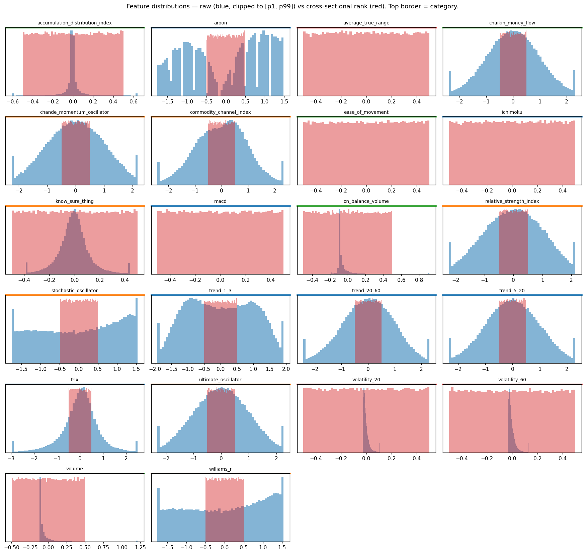

The learning target is the **cross-sectionally demeaned next-day return**, which strips the daily market factor and focuses the model on the stock-vs-stock dispersion a dollar-neutral portfolio actually harvests.

### Why Nonlinearity Matters

The decile plots below show the mean next-day return for each feature decile. Several indicators (Aroon, Know Sure Thing, MACD, trend\_1\_3, TRIX) show non-monotone shapes — a pattern a linear model cannot fit but a tree ensemble can.

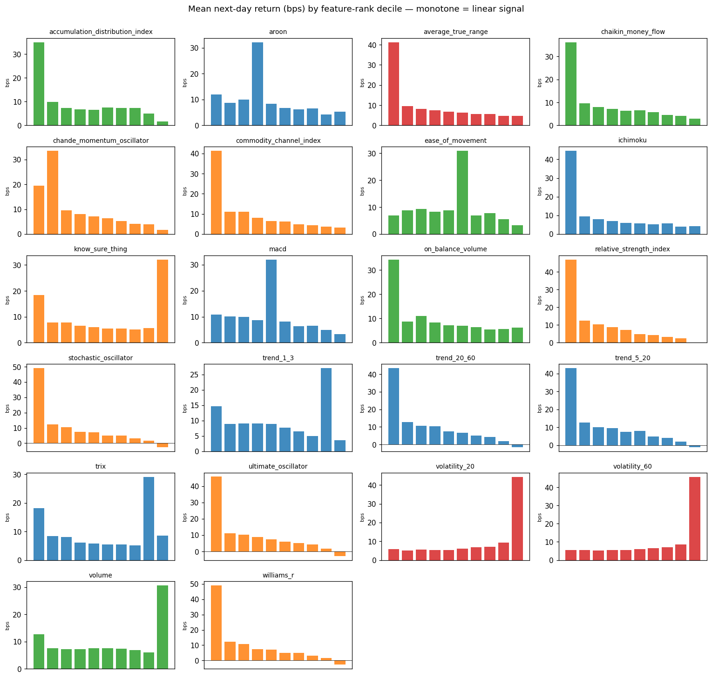

### Feature Correlation Structure

Several momentum and volatility transforms are near-collinear, which degrades linear estimators and motivates either regularisation or nonlinearity.

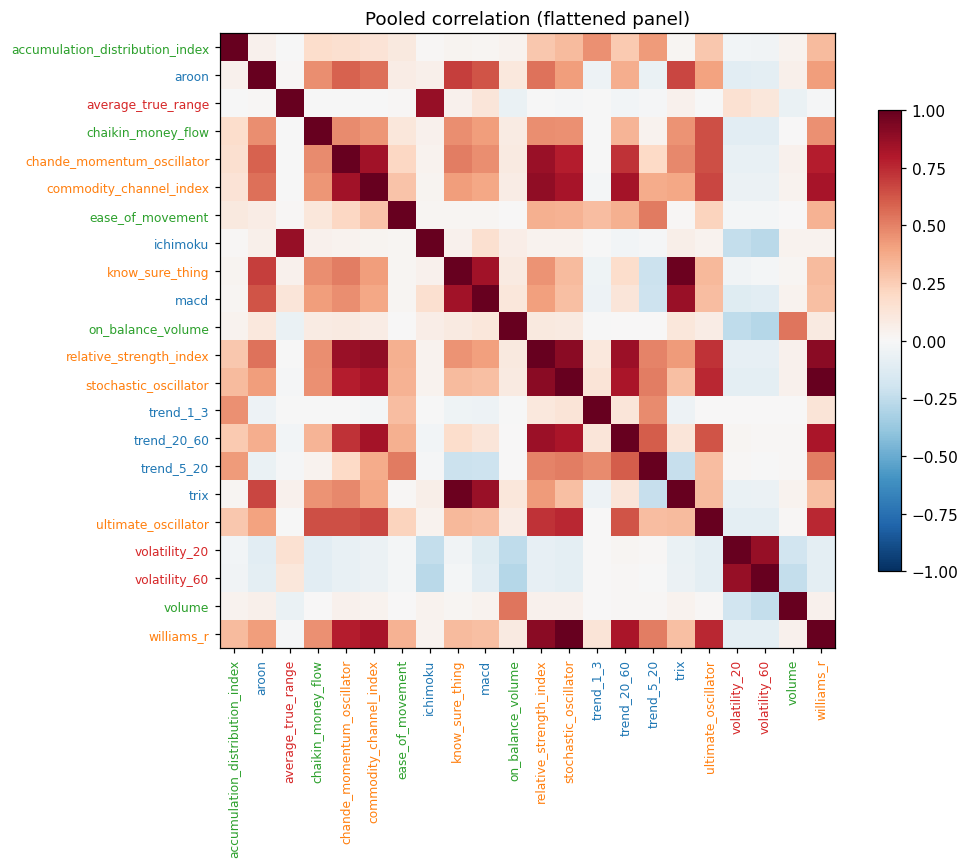

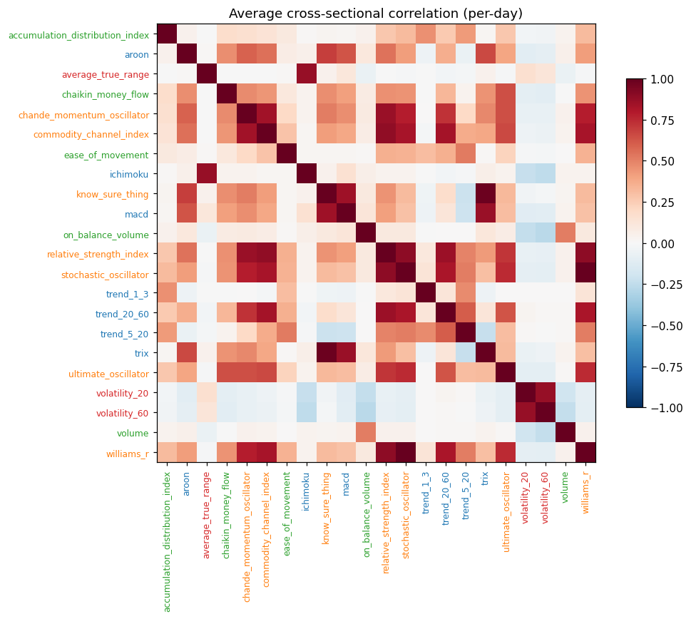

Hierarchical clustering reveals that data-driven groupings diverge from the naive taxonomy — for example, Ichimoku clusters with the volatility group rather than the trend group.

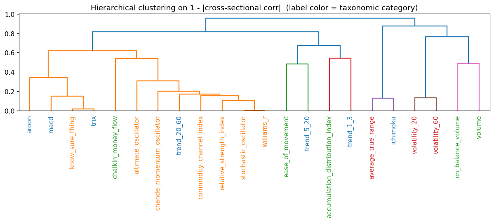

### Signal Stability Over Time

The rolling 252-day IC for the strongest univariate signals shows large regime-dependent swings, motivating walk-forward evaluation rather than standard k-fold cross-validation.

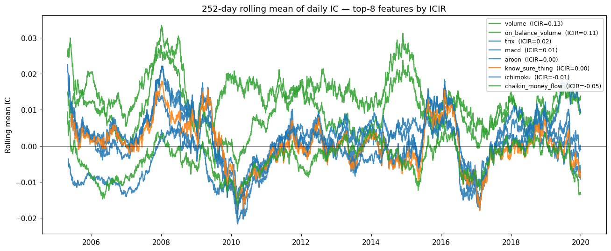

### Leakage-Free Evaluation

Standard k-fold is invalid on financial panel data because temporally close observations share label information. I adopted a **walk-forward split with a 5-day embargo** at each boundary (following López de Prado 2018):

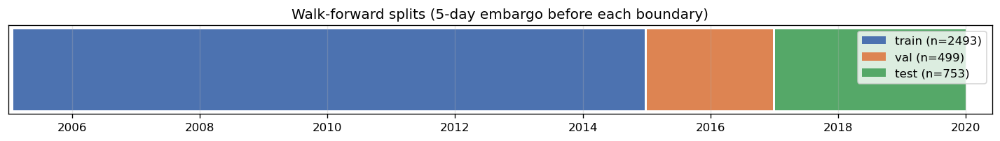

| Fold | Window | Days |
|---|---|---|
| Train | 2005-01-03 → 2014-12-31 | 2,493 |
| Validation | 2015-01-02 → 2016-12-31 | 499 |
| Test (held out) | 2017-01-03 → 2019-12-31 | 753 |

Model selection was done entirely on the validation fold. The test fold was touched exactly once for final reporting.

### Models

**Baseline (rule-based).** A hand-crafted signal combining On-Balance Volume and Ultimate Oscillator ranks — not a trivial benchmark, achieving net Sharpe 1.11 over the full 2005–2019 window.

**Ridge Regression.** A regularised linear model with L2 penalty, sweeping α ∈ {0.1, 1, 10, 100, 1000, 10000} and selecting by mean validation IC.

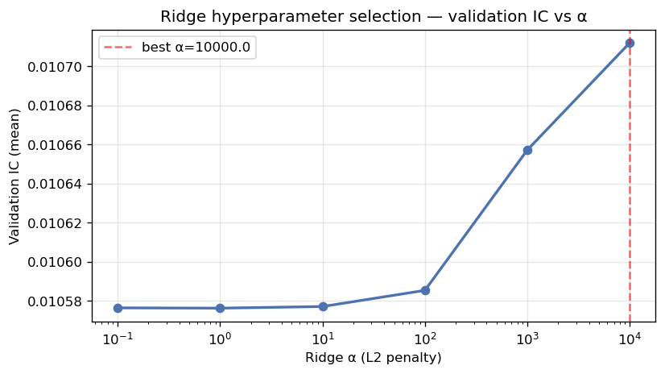

**LightGBM.** A gradient boosted decision tree ensemble. Five configurations were tuned over `num_leaves ∈ {15, 31, 63}`, `learning_rate ∈ {0.02, 0.05}`, and `min_child_samples ∈ {500, 2000}`, with early stopping evaluated by validation IC rather than MSE.

### Portfolio Construction

Model scores are converted to portfolio weights through a fully deterministic, model-agnostic layer: shift scores by one day (no look-ahead), apply the tradable universe mask, subtract the daily cross-sectional mean (dollar neutrality), normalise to unit L1 capital, and iteratively cap any single-stock weight above 10%. A 1 basis point transaction cost is applied to traded capital to compute net P&L.

## Results & Impact

### Test Fold Performance (2017–2019)

| Model | IC | ICIR | Gross Sharpe | Net Sharpe | Daily Turnover |
|---|---|---|---|---|---|
| Baseline (OBV − UO) | 0.0126 | 2.44 | 0.84 | 0.54 | 33.6% |
| Ridge (α = 10000) | 0.0043 | 0.66 | 0.45 | −0.05 | 76.7% |
| LightGBM (cfg 2) | 0.0108 | 2.35 | 0.82 | **0.59** | 96.1% |

### Cumulative P&L

Ridge drifts sideways and finishes slightly negative on the test fold — a direct consequence of losing 60% of its validation IC to regime shift.

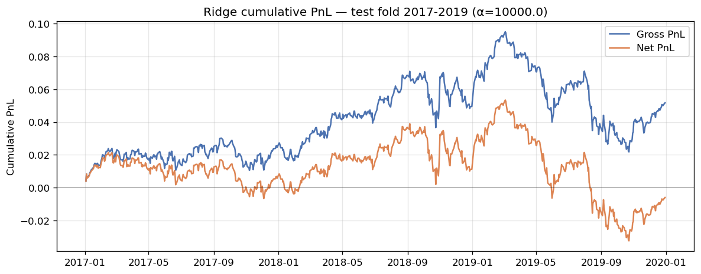

LightGBM tracks a positive drift but with visibly larger day-to-day swings, reflecting its higher turnover.

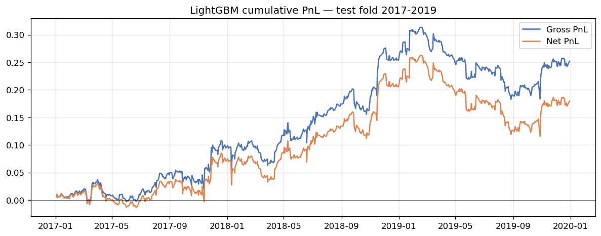

### What Each Model Learned

Ridge weights are dominated by short-term reversal and volume features, but the overall magnitude is small — consistent with the flat validation IC across the entire α grid.

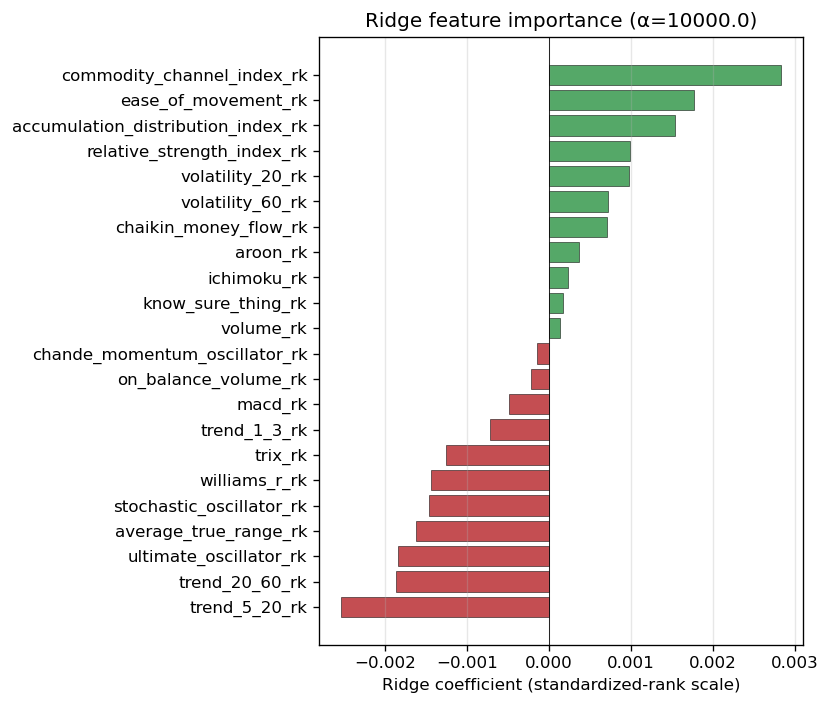

LightGBM concentrates gain-based importance on volatility (20/60-day) and volume features, consistent with the univariate EDA and with the dominance of momentum and liquidity signals in the broader empirical finance literature.

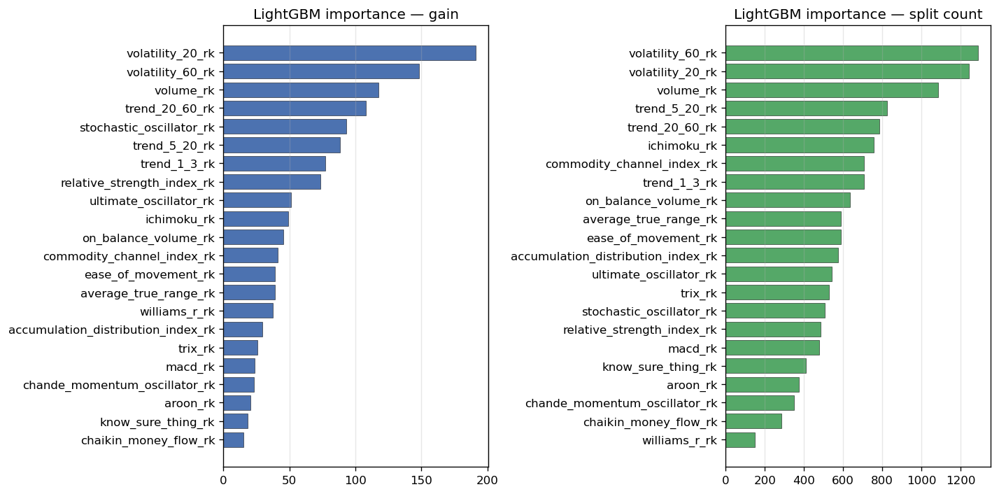

### Key Findings

**LightGBM genuinely extracts more signal.** On the validation fold it achieves IC 0.0213 and ICIR 4.08 — roughly 2× and 2.6× the best Ridge fit. Five of the 22 features show non-monotone return decile shapes that a linear model cannot capture but a tree ensemble can.

**Ridge does not generalise.** After rank normalisation the squared loss is already well-conditioned, so the L2 penalty has little effect. IC drops 60% from validation to test and net Sharpe turns slightly negative — a textbook example of the non-stationarity hazard.

**Stronger signal ≠ stronger net P&L.** LightGBM's gross Sharpe (0.82) is essentially tied with the baseline (0.84), and its net advantage (0.59 vs 0.54) is within noise. The mechanism is turnover: LightGBM rotates the portfolio at 96.1% of book per day — 2.9× the baseline — and 1 bp transaction costs consume most of the gross edge. Signal strength is necessary but not sufficient; controlling turnover and handling non-stationarity are the next binding constraints.
