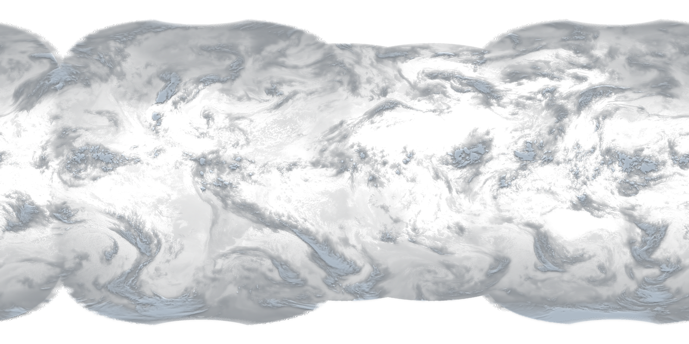
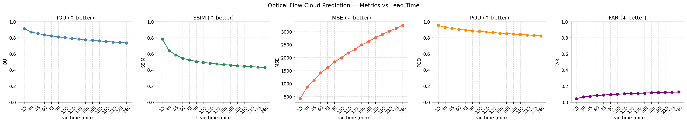
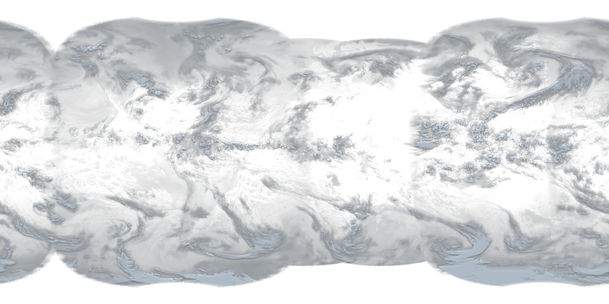
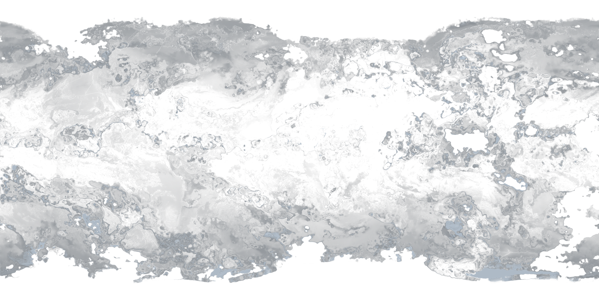
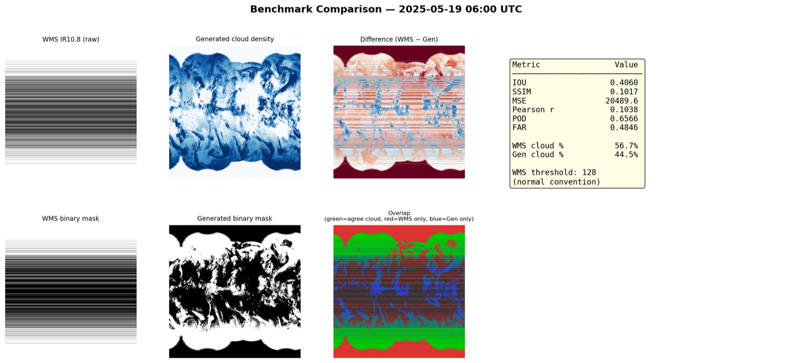

## Overview

A solar farm's biggest enemy isn't night — it's the cloud you didn't see coming. A single cumulus drifting across a 100 MW plant can drop its output by 70–90% in under a minute, and grid operators have to balance that swing in real time. The question that started this project was simple: **can I look at the whole planet's clouds right now and say, for any point on the ground, when the next shadow arrives and how much sun it will steal?**

The answer turned into a pipeline with three stages, each of which is its own small problem:

1. **Fusion** — stitch live cloud-mask data from *five* geostationary satellites into one seamless global map, every 15 minutes.
2. **Nowcasting** — predict the next 4 hours of cloud motion with dense optical flow, no neural network required.
3. **Physics correction** — undo the satellite's oblique viewing angle (parallax), then project each cloud's shadow onto the ground using solar geometry, and report the **GHI** (Global Horizontal Irradiance) reduction at any lat/lon.

The whole thing runs unattended on a 15-minute loop and produces a photorealistic global cloud render that genuinely looks like a view from space:



## Stage 1 — Fusing Five Satellites

### The coverage problem

No single geostationary satellite sees the whole Earth. Each one parks ~36,000 km above a fixed longitude and sees the disk beneath it. To cover the globe you need a ring of them, and they don't agree on anything — different instruments, different file formats, different cloud-classification schemes, different download mechanisms:

| Satellite | Covers | Product | Source |
|---|---|---|---|
| GOES-18 & GOES-19 | The Americas | ABI-L2-ACMF (`.nc`) | AWS S3, anonymous |
| Meteosat-0 & Meteosat-IODC | Europe/Africa, Indian Ocean | CLM GRIB (`.grb`) | EUMETSAT API (auth) |
| Himawari-8/9 | Asia/Pacific | AHI-L2 cloud mask (`.nc`) | AWS S3, anonymous |

The first job is to make these speak a common language. Everything gets resampled onto a shared **0.1° global lat/lon grid (3600 × 1800 pixels)** via `satpy` and `pyresample`, and every vendor's idiosyncratic integer codes get mapped to one **unified 4-class scheme** — `0 = clear`, `1 = probably clear`, `2 = probably cloudy`, `3 = cloudy`, `255 = no data`. Each source gets its own translation function (`map_goes_to_unified`, `map_meteosat_to_unified`, `map_himawari_to_unified`) because, for instance, what GOES calls "probably clear" is not the integer Himawari uses.

### Merging without seams

Once everything is on the same grid, the merge is a cascade of deliberate rules rather than a naive overwrite:

```
GOES-18 + GOES-19      → merged GOES      (max cloud class wins)
Meteosat-0 + IODC      → merged Meteosat  (max cloud class wins)
merged GOES + Meteosat → overlap rule at the Atlantic boundary
        + Himawari      → blended into the Pacific edge
```

Where two satellites both see a pixel, the conservative choice is **the higher cloud class** — a missed cloud is worse than a false one for this use case. The "max class wins" rule (`merge_by_max_class`) encodes exactly that.

The harder part is the *look*. A cloud mask is just integers; it doesn't look like anything. To make the render photorealistic — and, more importantly, to drive the physics later — I separately fetch **TBB (brightness temperature)** from each satellite's L1b infrared channel (ABI C13, SEVIRI IR_108, AHI B13). Cold pixels are tall clouds; warm pixels are the ground. The TBB mosaic is blended across satellite boundaries with a **40-pixel feathered distance transform** so the seams between, say, GOES and Meteosat over the Atlantic dissolve instead of showing a hard line:

```python
for arr, sat_mask in _sat_layers:
    valid  = np.isfinite(arr) & (sat_mask != 255)
    dist   = distance_transform_edt(valid)          # px-distance from the seam
    weight = np.clip(dist / FEATHER_PX, 0.0, 1.0)   # ramp 0→1 over 40 px
    weight[~valid] = 0.0
    _weights.append(weight); _arrays.append(arr)
# weighted average across all five layers → seamless TBB field
```

That brightness-temperature field is then mapped through a clear→deep-cloud ramp (`T_CLEAR = 295 K`, `T_DEEP = 215 K`), Gaussian-shaded with highlights, and given a soft alpha channel — which is why the hero image above reads as *volumetric* cloud rather than a flat mask.

## Stage 2 — Nowcasting With Optical Flow

### Why not a neural network?

The tempting modern answer is a ConvLSTM or a diffusion nowcaster. But cloud advection over a few hours is, to first order, **just motion** — clouds get carried by the wind field, and the wind field is locally smooth. Dense optical flow estimates that motion field directly from two consecutive frames, with no training data, no GPU, and full interpretability. For a 4-hour horizon that's not just adequate, it's arguably the right tool.

The predictor takes the **3 most-recent frames**, computes Farneback dense flow between each consecutive pair, and weights recent motion more heavily (the wind 15 minutes ago matters more than the wind 30 minutes ago):

```python
flow = cv2.calcOpticalFlowFarneback(
    prev_gray, nxt_gray, None,
    pyr_scale=0.3, levels=5, winsize=25,
    iterations=5, poly_n=7, poly_sigma=1.5,
    flags=cv2.OPTFLOW_FARNEBACK_GAUSSIAN,
)
# weighted average so the most recent pair dominates
weights = np.linspace(0.5, 1.0, len(selected))
velocity = sum(w * f for w, f in zip(weights, selected)) / sum(weights)
```

To forecast, I assume that velocity field persists and simply scale it: frame *i* is the last observed frame warped by `velocity × (i + 1)`. Sixteen steps of 15 minutes gives a **4-hour forecast**:

```python
for i in range(16):
    scaled_flow = velocity * (i + 1)
    pred = warp_frame(base_frame, scaled_flow)   # cv2.remap with cubic interp
```

The honest limitation lives in that single line: a *constant* velocity can't grow or dissipate clouds, only translate them. The further out you go, the more wrong that assumption becomes — and the evaluation shows exactly that decay.

### Does it actually work?

I evaluated the forecast against real future frames (target 2025-05-19 06:00 UTC), scoring each lead time on five metrics: **IOU** (shape overlap), **SSIM** (texture similarity), **MSE**, **POD** (probability of detection), and **FAR** (false alarm rate).



| Lead time | IOU | SSIM | POD | FAR |
|---|---|---|---|---|
| 15 min | **0.914** | 0.785 | **0.954** | 0.044 |
| 60 min | 0.836 | 0.545 | 0.905 | 0.084 |
| 120 min | 0.792 | 0.483 | 0.872 | 0.104 |
| 240 min | 0.736 | 0.431 | 0.825 | 0.127 |

The story in that table: **short-range nowcasting is excellent** (>0.9 IOU at 15 min), and the degradation is *graceful* rather than catastrophic — even at 4 hours, 5 in 6 clouds are still detected (POD 0.82). The SSIM column is the most informative one: it collapses far faster than IOU because optical flow preserves *where* a cloud is long after it stops preserving the fine swirl *texture* inside it. For a shadow-arrival forecast, position is what matters, so this failure mode is the benign one.

You can see the position-vs-texture trade-off directly by comparing a 2-hour forecast against what actually happened:




At the very end of the horizon, a second artifact shows up — because warping pushes pixels off the edge of the frame, the borders erode into the no-data colour. It's a cosmetic reminder that this is *extrapolation*, not physics:



### How does it compare to an operational product?

A model that only agrees with itself proves nothing. EUMETSAT publishes an operational multi-mission cloud product (`mumi:worldcloudmap_ir108`) over a public WMS endpoint, on the *same* 0.1° grid, so I built a benchmark harness to compare my generated map against theirs at matching timestamps:



| Timestamp | IOU | POD | FAR | Cloud cover (WMS vs Mine) |
|---|---|---|---|---|
| 06:00 UTC | 0.406 | 0.657 | 0.485 | 56.7% vs 44.5% |
| 09:00 UTC | 0.408 | 0.658 | 0.482 | 56.6% vs 44.6% |

The moderate IOU is partly an apples-to-oranges artifact — I'm comparing my *cloud-density alpha* against their *IR brightness threshold*, two different definitions of "cloud." But one finding survives that caveat and is genuinely actionable: **my pipeline systematically reports ~12% less cloud cover than EUMETSAT's**, consistently across both timestamps. The most likely culprit is the absence of inter-calibration between my five satellite sources — each has a slightly different sensitivity, and without harmonising them the merged total drifts low. That's a known, fixable next step rather than a mystery.

## Stage 3 — Where Does the Shadow Actually Land?

This is the stage that makes the whole thing useful, and it's pure geometry — no learning at all.

### The parallax problem

Here's the subtlety that trips up every naive cloud-shadow estimate. A geostationary satellite over the equator views a cloud in Europe at a steep, oblique angle. The cloud-mask pixel labelled "cloud" at (lat, lon) does **not** mean the cloud sits directly above that ground point — it's the position where the cloud *appears* along the satellite's slanted line of sight. A 10 km-tall cloud viewed at a 60° zenith angle is displaced **~17 km** from where it really is.

```
parallax shift ≈ cloud_top_height × tan(satellite_zenith_angle)
```

So before I can do anything physical, I have to shift every cloud pixel back toward the satellite's nadir to recover its true ground position. I compute the satellite zenith and azimuth for every grid pixel from spherical geometry, derive a cloud-top height (either from the real EUMETSAT CTH product or approximated from brightness temperature via a standard-atmosphere lapse rate), and **scatter** each cloud to its corrected cell — resolving collisions by keeping the highest cloud class:

```python
shift_m   = (0.75 * cth) * np.tan(theta_sat)        # 0.75×CTH per AMT-2025
delta_lat = -shift_m * np.cos(phi_sat) / 111_320.0
delta_lon = -shift_m * np.sin(phi_sat) / (111_320.0 * cos_lat)
# scatter each pixel to (lat+Δlat, lon+Δlon); clouds win collisions
np.maximum.at(out, (dst_row, dst_col), vals)
```

That `0.75 × CTH` factor isn't arbitrary — it comes from a 2025 *Atmospheric Measurement Techniques* paper which found that using **70–90% of the retrieved cloud-top height** (not the full height) minimises GHI error, because sunlight scatters through the lower, optically-thinner part of a cloud rather than being blocked at its very top.

### Projecting the shadow

Once clouds sit at their true positions, the shadow is a second geometric shift — this time governed by the **sun**, not the satellite. The shadow falls on the far side of the cloud from the sun, displaced by the same `height × tan(zenith)` law but using the *solar* zenith and azimuth. I compute those for the entire global grid in one vectorized pass using the Spencer/Iqbal equations (accurate to ±0.5°, ample at 0.1° resolution):

```python
# shadow falls OPPOSITE to the sun's direction
shadow_lat = lat - shift_m * np.cos(solar_az) / 111_320.0
shadow_lon = lon - shift_m * np.sin(solar_az) / (111_320.0 * cos_lat)
# night-side pixels (zenith > 85°) cast no usable shadow → skipped
```

Night-side and near-horizon pixels are dropped automatically (no sun, no shadow, no GHI to lose). The output is a binary global shadow footprint — every ground cell that is currently in cloud shadow.

And because the shadow mask lives on the same grid as everything else, I can warp it with the *same* optical-flow velocity field from Stage 2. That gives me 16 future shadow masks — a 4-hour forecast of the shadows themselves.

### From shadow mask to a number a solar operator can use

The final module, `ghi_forecast.py`, closes the loop. Give it a latitude and longitude — a solar farm, a city, a pyranometer — and it reads the 16 predicted shadow masks and answers the operational questions directly:

```text
GHI shadow forecast for (48.5000°N, 9.2000°E)
  Horizon         : 240 min (16 steps × 15 min)
  Shadow arrives  : 2025-06-01T10:45:00+00:00
  Duration        : 45 min
  Shadow fraction (4 h) : 18.8%
  Est. GHI reduction    : 15.0 %
```

*"A shadow reaches you in 45 minutes, lasts 45 minutes, and over the next 4 hours you'll lose about 15% of your potential irradiance."* That's the sentence a grid balancer or a solar-plant controller actually needs — and it came out of a cloud-mask integer, a wind field estimated from two images, and two lines of trigonometry.

## The Pipeline Glue

All three stages run on a 15-minute loop in `pipeline_runner.py`. One detail there is worth calling out because it's a classic long-running-process bug: the downloader computes its target timestamp at *module load time*. A naive `while True` loop would keep forecasting for the same frozen minute forever. The fix is to `importlib.reload()` both modules every cycle so `TARGET_TIME_UTC` is re-evaluated against the real wall clock:

```python
importlib.reload(satellite_downloader)   # re-evaluates TARGET_TIME_UTC = now()
importlib.reload(optical_flow_predictor)
```

The loop also caps the image archive at 96 frames (exactly one day at 15-min cadence, oldest deleted first) and only triggers a forecast if a *new* image actually downloaded — so a transient satellite outage degrades gracefully instead of forecasting from stale data.

## What I Learned

- **Match the model to the physics, not to the trend.** The reflex was to reach for a deep nowcasting network. But cloud advection over a few hours *is* a smooth motion field, and dense optical flow estimates it directly — interpretably, on a CPU, with zero training data — and the evaluation backs that up (IOU 0.91 at 15 min). The right question wasn't "which network?" but "is this even a learning problem?"
- **The unglamorous geometry is where the value is.** Anyone can warp a cloud forward. The thing that turns a pretty animation into a *solar-energy tool* is the parallax + shadow correction — recognising that the cloud isn't where the satellite says it is, and the shadow is somewhere else again. Three coordinate shifts, each one a `height × tan(angle)`, are what connect the pixel to the panel.
- **Benchmarking against an operational product is humbling and essential.** Comparing against EUMETSAT's WMS surfaced a systematic 12% cloud-cover underestimate I would never have caught by eye. A model that only agrees with itself is a model you can't trust — the disagreement *is* the signal.
- **Read the domain literature for the constants.** The `0.75 × CTH` factor looks like a magic number, but it encodes a real radiative-transfer finding from an AMT 2025 study. Borrowing one constant from the right paper did more for GHI accuracy than any amount of tuning the optical-flow parameters.
- **Long-running pipelines fail in boring ways.** Frozen module-level timestamps, stale-data forecasts after an outage, unbounded disk growth — none of these show up in a notebook. The `importlib.reload`, the new-image guard, and the 96-frame cap are the difference between a demo and something that survives a week unattended.

## Limitations & Next Steps

- **Constant-velocity motion can't grow or dissipate clouds** — only translate them. This is the dominant forecast error past ~2 hours. A semi-Lagrangian scheme with a growth/decay term, or a learned residual on top of the optical-flow base, would extend the useful horizon.
- **No inter-satellite calibration**, the likely cause of the 12% cloud-cover underestimate. Histogram-matching the five sources before merging is the obvious fix.
- **CTH from brightness temperature is approximate** and breaks for multi-layer clouds, where the AMT 2025 study found geometric correction fails outright. Flagging multilayer pixels (and preferring the real NWCSAF CTH product everywhere) would harden the shadow stage.
- **The GHI reduction is a fixed 80%-under-shadow heuristic**, not a calibrated radiative-transfer estimate. Validating the forecast against a real pyranometer network (the way the AMT paper did over Jülich) is the natural way to turn "≈15%" into a trustworthy number.
